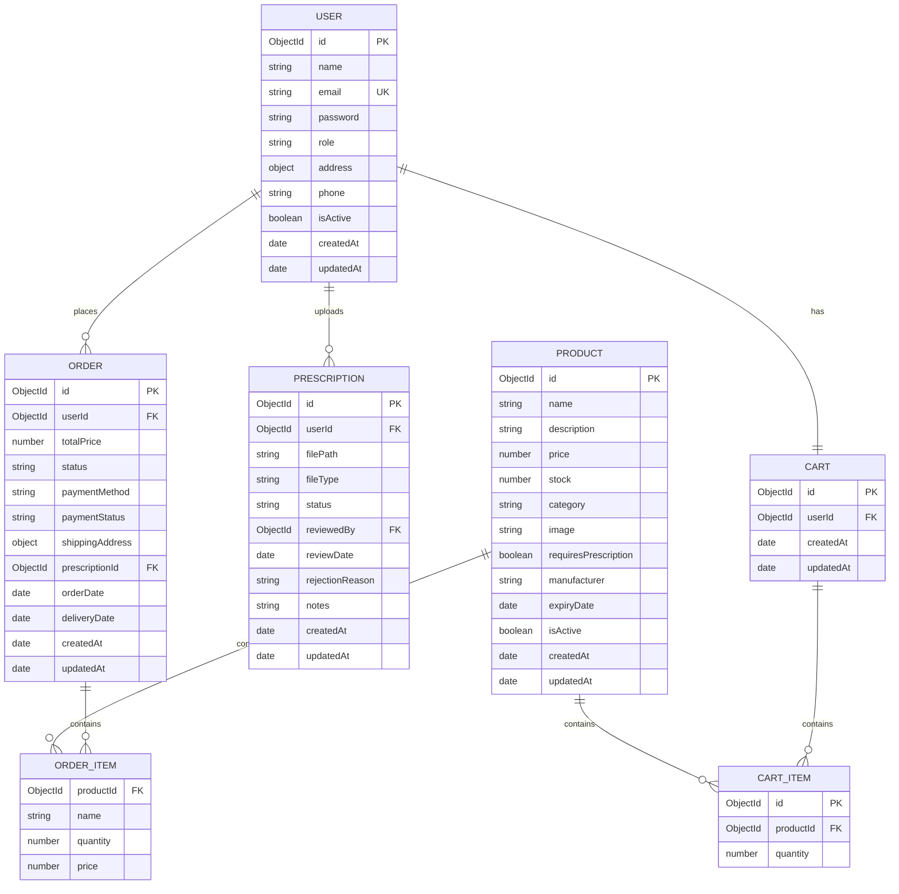
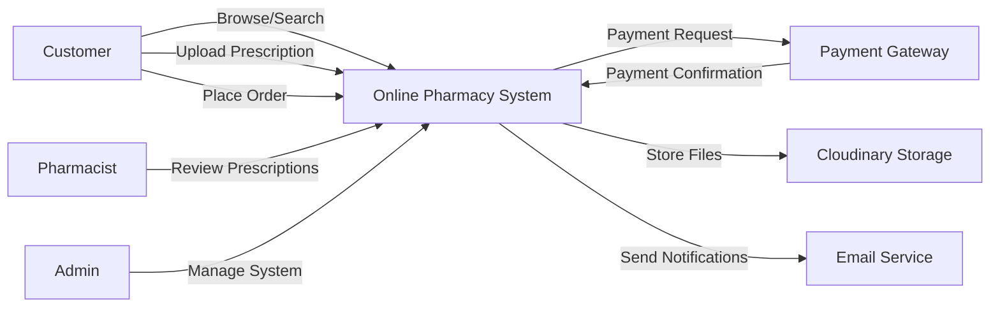
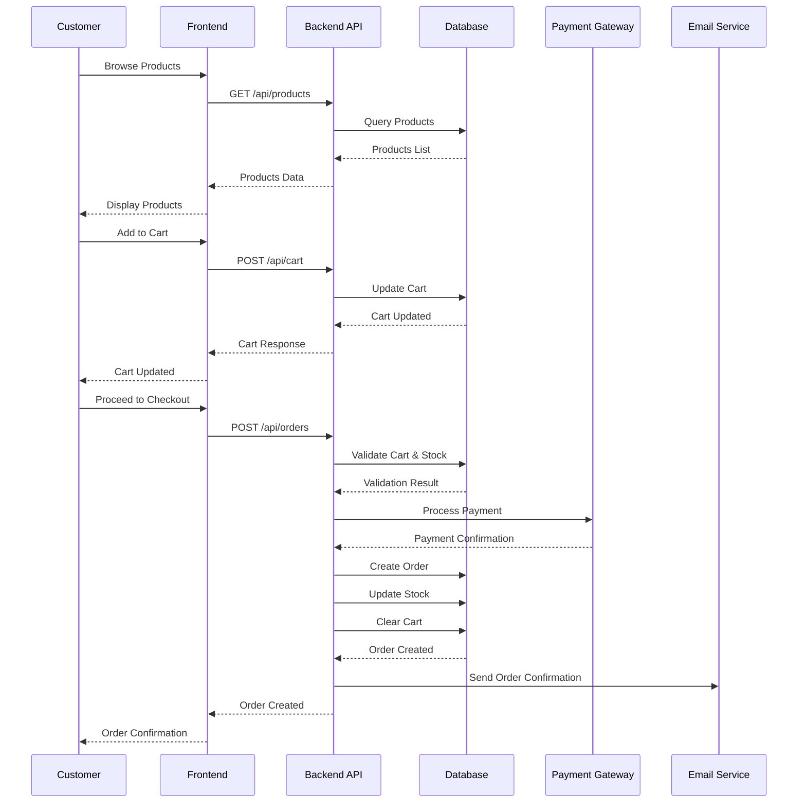
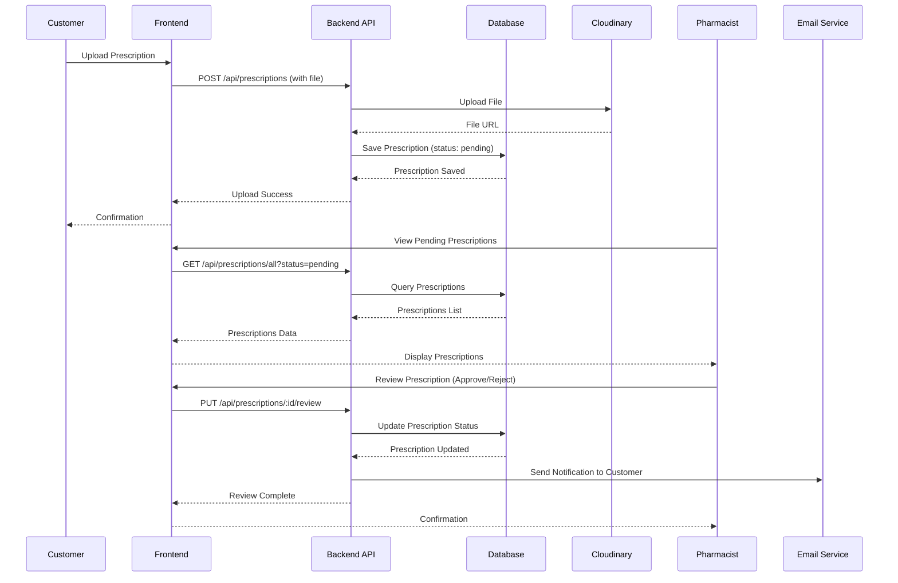
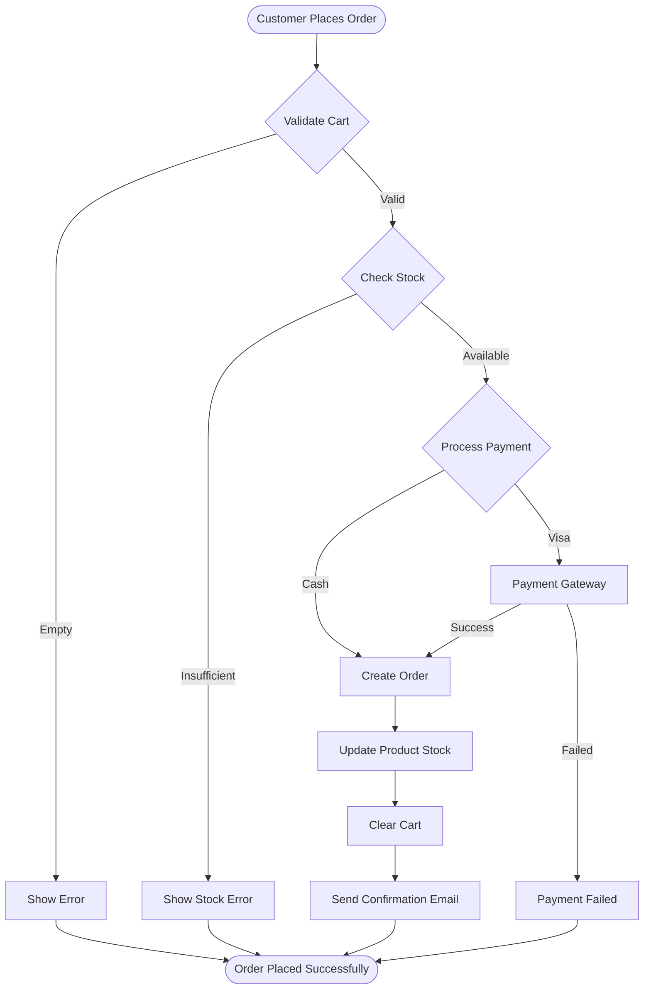
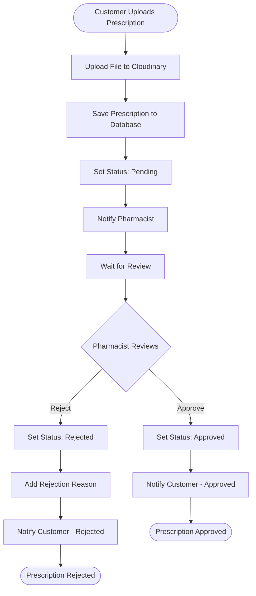
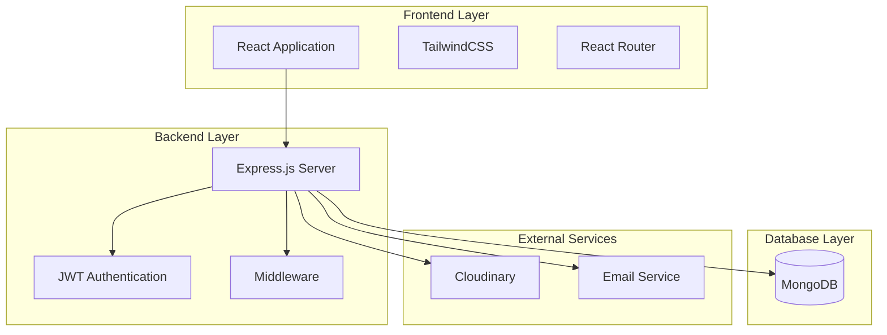

# System Diagrams - Online Pharmacy System

## 1. Entity Relationship Diagram (ERD)

## 2. Use Case Diagram

```mermaid
graph TB
    Customer[Customer]
    Pharmacist[Pharmacist]
    Admin[Admin]
    System[Online Pharmacy System]
    
    Customer -->|Register/Login| System
    Customer -->|Browse Products| System
    Customer -->|Search Products| System
    Customer -->|Add to Cart| System
    Customer -->|Upload Prescription| System
    Customer -->|Place Order| System
    Customer -->|Track Order| System
    Customer -->|View Orders| System
    
    Pharmacist -->|Login| System
    Pharmacist -->|View Prescriptions| System
    Pharmacist -->|Approve Prescription| System
    Pharmacist -->|Reject Prescription| System
    Pharmacist -->|View Orders| System
    
    Admin -->|Login| System
    Admin -->|Manage Users| System
    Admin -->|Manage Products| System
    Admin -->|Manage Categories| System
    Admin -->|View All Orders| System
    Admin -->|View Statistics| System
    Admin -->|System Settings| System
```

## 3. Data Flow Diagram (DFD) - Level 0

## 4. Sequence Diagram - Order Placement

## 5. Sequence Diagram - Prescription Review

## 6. Activity Diagram - Order Processing

## 7. Activity Diagram - Prescription Workflow

## 8. System Architecture Diagram

